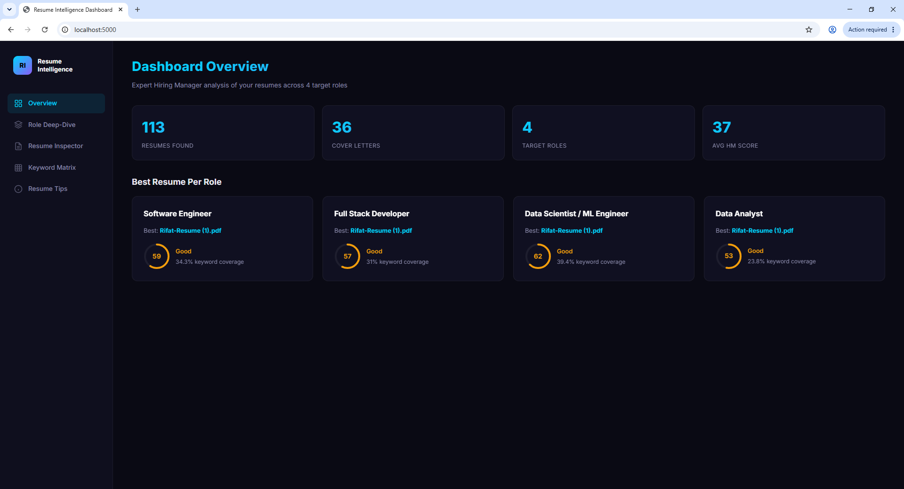
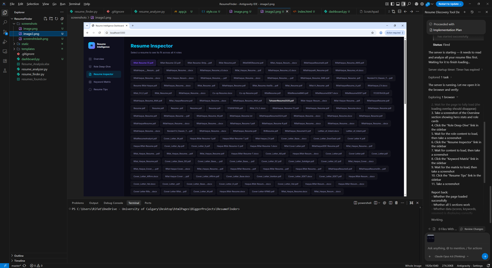
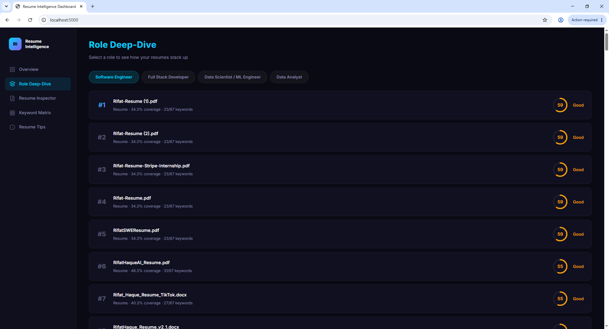
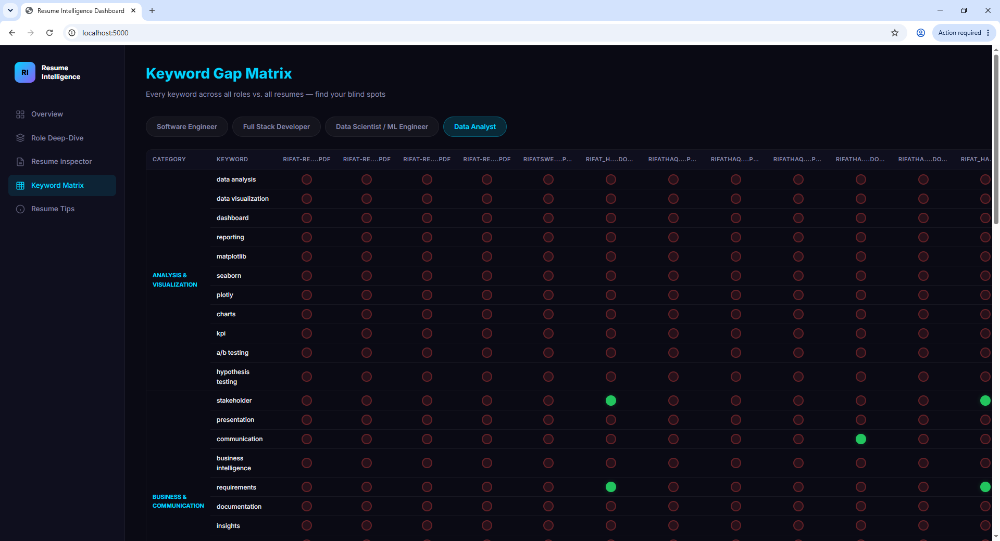

# Resume Intelligence Dashboard v2

> **An AI-powered Hiring Manager analytics platform and ATS optimization engine.**  
> Automatically indexes, scores, audits, and matches your resumes against tech industry roles using local LLMs & RAG (Retrieval-Augmented Generation).

---

## 📸 Screenshots

| Executive Dashboard | Resume Inspector |
| :---: | :---: |
|  |  |

| Role Deep Dive | Keyword Gap Matrix |
| :---: | :---: |
|  |  |

---

## ✨ Key Features

- 📊 **Multi-Role ATS Evaluation**: Evaluates resumes with tailored heuristics, keyword weights, and scoring algorithms across 4 core engineering tracks:
  - **Software Engineer**
  - **Data Scientist / Machine Learning Engineer**
  - **DevOps / Cloud Platform Engineer**
  - **Full Stack Developer**
- 🔍 **Interactive Resume Inspector**: Inspect any resume in detail — view word counts, detected companies, keyword hit/miss breakdowns, and per-role score trajectories.
- 🗺️ **Keyword Matrix & Heatmap**: Cross-resume heatmap highlighting coverage of critical industry keywords (languages, frameworks, cloud tooling, CI/CD, databases).
- 💡 **Actionable Optimization Tips**: Instant hiring-manager-grade advice pointing out missing credentials, bullet point quality, and tailored improvement recommendations.
- 🤖 **AI Career Advisor & RAG Chat**: Interactive conversational assistant powered by a local Ollama LLM (`llama3.1:8b`) with vector semantic search over your entire resume history.
- 🎯 **Targeted Job Description Matcher**: Paste any job description to discover which of your resumes is the strongest fit and receive a targeted gap analysis.
- ⚡ **Multi-Format Ingestion**: Full text extraction and SHA-256 deduplication for `.pdf`, `.docx`, and `.txt` files.

---

## 🛠️ Tech Stack

### Frontend
- **Framework**: [Next.js](https://nextjs.org/) (App Router, Turbopack) & [React](https://react.dev/)
- **Language**: [TypeScript](https://www.typescriptlang.org/)
- **Styling**: [Tailwind CSS](https://tailwindcss.com/)
- **Design Philosophy**: High information-density dashboard, dark aesthetic, clean typography, strict surface borders, zero fluff.

### Backend & AI
- **API Framework**: [FastAPI](https://fastapi.tiangolo.com/) & [Uvicorn](https://www.uvicorn.org/)
- **ORM / Database**: [SQLAlchemy](https://www.sqlalchemy.org/) with [PostgreSQL](https://www.postgresql.org/) + [pgvector](https://github.com/pgvector/pgvector) *(or SQLite local fallback)*
- **Local AI / LLM**: [Ollama](https://ollama.com/) running `llama3.1:8b`
- **Embeddings**: `nomic-embed-text` / `all-MiniLM-L6-v2` (768-dim / 384-dim)
- **Document Processing**: `PyPDF2`, `python-docx`

---

## 📁 Project Structure

```text
ResumeFinder/
├── backend/                  # FastAPI Application
│   ├── main.py               # FastAPI entry point & CORS configuration
│   ├── config.py             # Pydantic environment configuration
│   ├── database.py           # SQLAlchemy session & pgvector detection
│   ├── models.py             # ORM models (Resume, ResumeAnalysis, Chunks, Chat)
│   ├── schemas.py            # Pydantic schemas for request/response validation
│   ├── routers/
│   │   ├── resumes.py        # /api/resumes (List, Detail, Upload)
│   │   ├── roles.py          # /api/roles, /api/overview, /api/keyword-matrix
│   │   ├── chat.py           # /api/chat (RAG conversation history)
│   │   └── jobs.py           # /api/jobs/match (Job description gap matcher)
│   └── services/
│       ├── analyzer.py       # Role definitions, keyword scoring, heuristic rules
│       ├── embeddings.py     # Document chunking & vector embedding generation
│       ├── ollama.py         # Local LLM completion & embedding client
│       ├── rag.py            # Vector similarity search & context assembly
│       └── scanner.py        # Text extraction (PDF/DOCX) & deduplication
│
├── frontend/                 # Next.js Application
│   ├── src/app/
│   │   ├── page.tsx          # Overview Dashboard & KPI summary
│   │   ├── inspector/        # In-depth Resume Inspector
│   │   ├── roles/            # Role ranking & deep dives
│   │   ├── matrix/           # Keyword gap matrix & heatmaps
│   │   ├── tips/             # Recommendations & hiring manager tips
│   │   ├── chat/             # AI Career Advisor (RAG chat)
│   │   └── jobs/             # Job description matcher
│   └── package.json
│
├── scripts/
│   ├── seed_db.py            # Batch imports & parses from legacy CSV
│   └── add_resume.py         # CLI tool to ingest & analyze a single resume
│
├── screenshots/              # UI preview screenshots
├── .env.example              # Environment variables template
├── resumes_found.csv         # Baseline resume catalog
└── README.md
```

---

## 🚀 Getting Started

### 1. Prerequisites
- **Python 3.10+**
- **Node.js 18+** & **npm** (or `pnpm`)
- *(Optional for AI)* **[Ollama](https://ollama.com/)** with `llama3.1:8b` and `nomic-embed-text`:
  ```bash
  ollama pull llama3.1:8b
  ollama pull nomic-embed-text
  ```

---

### 2. Environment Configuration

Copy the example environment file to `.env` in the project root:

```bash
cp .env.example .env
```

Adjust variables as needed:
```ini
# Database (SQLite by default, or your PostgreSQL / AWS RDS URL)
DATABASE_URL=sqlite:///./resume_intelligence.db

# Local Ollama AI settings
OLLAMA_BASE_URL=http://localhost:11434
OLLAMA_MODEL=llama3.1:8b

# Frontend URL (for CORS)
FRONTEND_URL=http://localhost:3000
```

---

### 3. Backend Setup

1. Install Python dependencies:
   ```bash
   pip install -r backend/requirements.txt
   ```

2. Seed the initial database (imports & scores resumes from catalog):
   ```bash
   python -m scripts.seed_db
   ```

3. Run the backend server:
   ```bash
   python -m uvicorn backend.main:app --reload --port 8000
   ```
   - **API Docs (Swagger UI)**: [http://localhost:8000/docs](http://localhost:8000/docs)
   - **Health Check**: [http://localhost:8000/api/health](http://localhost:8000/api/health)

---

### 4. Frontend Setup

1. Navigate to the `frontend/` folder:
   ```bash
   cd frontend
   ```

2. Install dependencies:
   ```bash
   npm install
   ```

3. Launch the development server:
   ```bash
   npm run dev
   ```
   Open **[http://localhost:3000](http://localhost:3000)** in your browser.

---

## 📄 Adding New Resumes

You can add any `.pdf`, `.docx`, or `.txt` resume at any time:

### Method A: Via Command Line (Recommended)
From the project root:
```bash
python -m scripts.add_resume "C:\path\to\your\resume.pdf"
```
The resume is instantly parsed, scored across all target roles, embedded, and added to the database.

### Method B: Via Swagger UI
1. Navigate to [http://localhost:8000/docs](http://localhost:8000/docs).
2. Expand `POST /api/resumes/upload`.
3. Choose your file and click **Execute**.

---

## 🔌 API Reference

| Method | Endpoint | Description |
| :--- | :--- | :--- |
| `GET` | `/api/overview` | Overall dashboard metrics, best resume per role, and averages |
| `GET` | `/api/resumes` | List all resumes with scores and metadata |
| `POST` | `/api/resumes/upload` | Upload and analyze a new resume file |
| `GET` | `/api/resumes/{id}` | Full deep-dive analysis, keyword hit/miss, and tips for a resume |
| `GET` | `/api/role/{role_name}` | Leaderboard and metrics for a specific role |
| `GET` | `/api/keyword-matrix` | Keyword presence heatmap across all indexed resumes |
| `POST` | `/api/jobs/match` | Match a job description against all resumes + gap analysis |
| `POST` | `/api/chat` | RAG-powered interactive career consultation chat |
| `GET` | `/api/health` | Health status and Ollama availability indicator |

---

## 🔒 License
Private / Personal Project.
